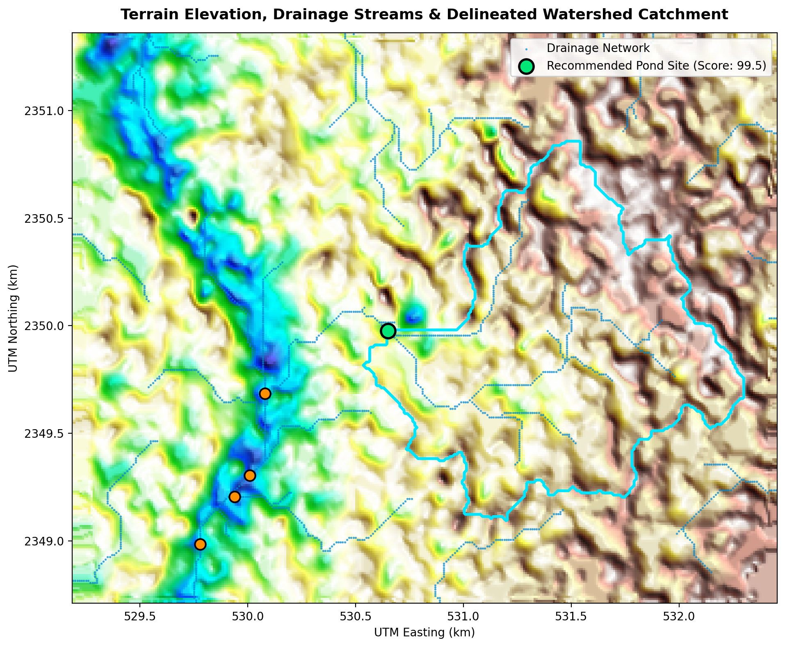
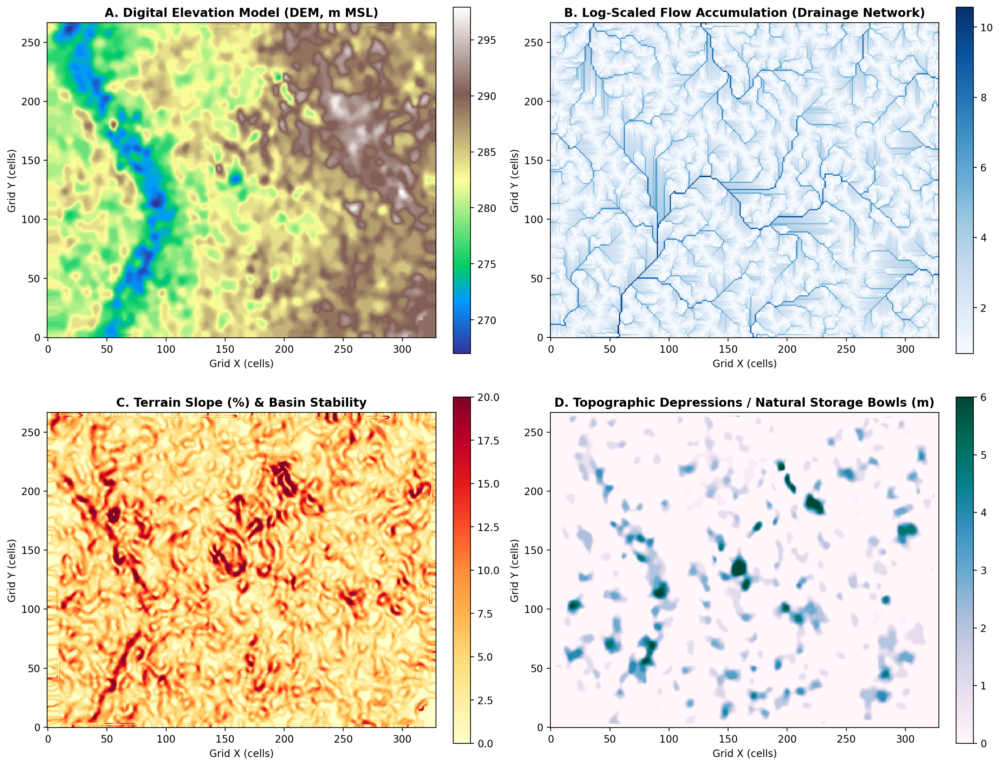

# Project Submission Report: Village Pond Planning & Catchment Analysis Backend System

---

## 1. Project Information & Repository

- **GitHub Repository**: [https://github.com/hansikareddy29/Village-Pond-Planning-Systems](https://github.com/hansikareddy29/Village-Pond-Planning-Systems)
- **Primary Working API Endpoint**: `POST http://localhost:8000/analyzeContour`
- **Alias Working API Endpoint**: `POST http://localhost:8000/findCatchment`
- **Health Check URL**: `GET http://localhost:8000/health`
- **Interactive OpenAPI Documentation**: `http://localhost:8000/docs`
- **Interactive Web Visualization Dashboard**: `http://localhost:8000/`

---

## 2. Executive Summary

This project implements an automated, generalized, production-ready backend system for **Village Pond Planning and Hydrological Catchment Analysis** from raw contour maps in KML and KMZ formats. 

Given an uploaded contour dataset, the system:
1. Automatically parses 3D contour geometries, line strings, and elevation tags.
2. Projects geographic coordinates to the appropriate local metric Universal Transverse Mercator (UTM) coordinate system.
3. Interpolates a continuous, high-resolution Digital Elevation Model (DEM) using Delaunay Triangulation and Barycentric TIN surface modeling.
4. Performs advanced digital hydrology: Priority-Flood depression filling, D8 steepest descent flow direction routing, vectorized flow accumulation, and stream network extraction.
5. Identifies natural topographic sinks/bowls and calculates natural storage volume.
6. Evaluates candidate pond locations using a multi-criteria decision analysis (MCDA) scoring framework (catchment yield, depression depth, slope stability, and topographic wetness index).
7. Delineates the exact upstream contributing watershed catchment boundary polygon and calculates surface area ($m^2$, ha, acres), perimeter, elevation statistics, and annual runoff volume.
8. Returns structured JSON output with GeoJSON layers and provides a full-featured web dashboard for interactive visual exploration.

---

## 3. Catchment Estimation & Terrain Analysis Methodology

### 3.1. Generalization & Coordinate Projection
To ensure true geographic generalization without hardcoded coordinates:
- The system computes the geographic centroid $(\lambda_c, \phi_c)$ from parsed contour vertices.
- It dynamically identifies the corresponding UTM Zone:
  $$\text{UTM Zone} = \left\lfloor \frac{\lambda_c + 180^\circ}{6^\circ} \right\rfloor + 1$$
- The system initializes high-precision bidirectional transformers (`pyproj.Transformer`) between `EPSG:4326` (WGS84) and `EPSG:32600 + Zone` (or `32700 + Zone` in Southern Hemisphere). All spatial distances, cell sizes, slopes, areas ($m^2$), and storage volumes ($m^3$) are computed in true metric units.

### 3.2. Continuous DEM Grid Generation
Contour lines provide sparse elevation samples. To build a continuous topographic surface:
1. Contour vertices $(X_i, Y_i, Z_i)$ in metric UTM space are used to construct a Delaunay Triangulation.
2. Linear barycentric interpolation (`scipy.interpolate.griddata`) evaluates elevations on a regular 2D grid ($\Delta x = \Delta y = 10\text{m}$).
3. Boundary margins are closed using nearest-neighbor spatial extrapolation.
4. A spatial Gaussian filter eliminates discretization steps from contour lines, creating a smooth hydrological gradient.

$$\text{Slope } S = \sqrt{\left(\frac{\partial Z}{\partial x}\right)^2 + \left(\frac{\partial Z}{\partial y}\right)^2} \times 100\%$$

### 3.3. Priority-Flood Depression Filling & Sink Detection
Surface runoff in natural terrain can be trapped in hollows. The algorithm employs the **Priority-Flood Algorithm** (Barnes et al.):
- A min-priority queue tracks elevation wavefronts starting from DEM outer boundaries inward.
- The filled elevation surface $Z_{\text{filled}}(r, c)$ ensures continuous downslope drainage paths across the entire landscape.
- Topographic depression depth is extracted as:
  $$D_{\text{depression}}(r, c) = \max\left(0, Z_{\text{filled}}(r, c) - Z_{\text{original}}(r, c)\right)$$
- Connected sinks are segmented and their natural storage capacity is integrated:
  $$V_{\text{storage}} = \sum_{(i,j) \in \text{Sink}} \left(Z_{\text{spill}} - Z_{i,j}\right) \cdot \Delta x \cdot \Delta y$$

### 3.4. D8 Flow Direction & Vectorized Flow Accumulation
- **D8 Flow Direction**: Runoff from each cell $(r, c)$ drains to one of its 8 neighboring cells $(r + \Delta r_k, c + \Delta c_k)$ along the steepest descent gradient:
  $$S_k = \frac{Z_{\text{filled}}(r, c) - Z_{\text{filled}}(r + \Delta r_k, c + \Delta c_k)}{d_k \cdot \text{resolution}}$$
  where $d_k = 1$ for cardinal neighbors and $d_k = \sqrt{2}$ for diagonal neighbors.
- **Topological Flow Accumulation**: Sorted in descending elevation order, each cell passes its accumulated drainage area to its downstream neighbor in $O(N)$ time:
  $$A_{\text{acc}}(r_{\text{down}}, c_{\text{down}}) \leftarrow A_{\text{acc}}(r_{\text{down}}, c_{\text{down}}) + A_{\text{acc}}(r, c)$$
- **Stream Network Extraction**: Cells with flow accumulation exceeding the 98th percentile ($A_{\text{acc}} \ge T_{\text{stream}}$) form natural surface drainage channels.

### 3.5. Multi-Criteria Optimal Pond Siting (MCDA)
Optimal village pond planning requires balancing hydrological yield, excavation cost, and embankment safety. Siting candidates are scored across four dimensions:
1. **Catchment Yield Score ($S_{\text{catchment}}$)**: Upstream contributing area ($w_1 = 0.40$).
2. **Natural Bowl / Depression Score ($S_{\text{depression}}$)**: Existing depression depth minimizing excavation ($w_2 = 0.25$).
3. **Slope Stability Score ($S_{\text{slope}}$)**: Gentle bed slope $< 5\%$ preventing dam failure ($w_3 = 0.20$).
4. **Topographic Wetness Index ($S_{\text{twi}}$)**: $\text{TWI} = \ln\left(\frac{A_{\text{upstream}}}{\tan(\text{slope})}\right)$ indicating moisture retention ($w_4 = 0.15$).

$$\text{Suitability Index} = 100 \times \left(0.40 \cdot S_{\text{catchment}} + 0.25 \cdot S_{\text{depression}} + 0.20 \cdot S_{\text{slope}} + 0.15 \cdot S_{\text{twi}}\right)$$

### 3.6. Watershed / Catchment Delineation & Vector Polygonization
- For the selected optimal pond outlet $(r_0, c_0)$, an inverted Breadth-First Search (BFS) traverses all upstream cells that route water to $(r_0, c_0)$.
- The binary raster mask is vectorized using contour boundary extraction into a clean Shapely `Polygon` and transformed back to WGS84 coordinates.
- Annual water yield is calculated using the **Rational Method**:
  $$V_{\text{annual\_runoff}} = C \cdot P_{\text{annual}} \cdot A_{\text{catchment}}$$
  where $C$ is the runoff coefficient (default $0.35$), $P$ is annual precipitation in meters, and $A$ is the catchment area in $m^2$.

---

## 4. Demonstration on Sample Contour Map (`contours_1m.kml`)

### 4.1. Input Map Summary
- **File**: `contours_1m.kml`
- **Total Contours Extracted**: 1,355 contour polylines
- **3D Coordinate Vertices**: 160,468 points
- **Contour Interval**: 1.0 meter
- **Geographic Extent**: Longitude $[81.2814^\circ, 81.3126^\circ\text{ E}]$, Latitude $[21.2398^\circ, 21.2636^\circ\text{ N}]$
- **Elevation Range**: 267.0 m to 297.9 m (Total Relief: 30.9 m)
- **Auto-Detected Projection**: UTM Zone 44N (`EPSG:32644`)
- **DEM Grid Size**: 267 rows $\times$ 329 columns (87,843 cells @ 10.0m resolution)

### 4.2. Recommended Optimal Pond Location (Rank 1)
- **Site ID**: `pond_site_1`
- **Latitude / Longitude**: **$21.251178^\circ\text{ N}, 81.295404^\circ\text{ E}$**
- **UTM Coordinates**: Easting $530,649.5\text{ m}$, Northing $2,349,975.3\text{ m}$
- **Base Elevation**: **278.00 m MSL**
- **Composite Suitability Score**: **99.5 / 100**
- **Local Slope**: **$0.38\%$** (very gentle, ideal for earth embankment stability)
- **Natural Depression Depth**: **$4.02\text{ m}$** (significant natural hollow)
- **Selection Rationale**: *"Substantial upstream drainage (161.2 ha); Located in a natural topographic bowl (4.0m depth) reducing excavation; very gentle bed slope (0.4%) for stable embankment."*

### 4.3. Catchment / Watershed Results
- **Total Catchment Area**: **161.18 hectares** ($1,611,800\text{ m}^2$ / $398.28\text{ acres}$)
- **Catchment Perimeter**: **6,832.0 meters** ($6.83\text{ km}$)
- **Catchment Elevation Range**: 276.0 m to 297.8 m (Mean: 286.76 m)
- **Catchment Average Slope**: $5.26\%$ ($3.01^\circ$)
- **Estimated Annual Runoff Harvest**: **564.13 Million Liters / year** ($564,130\text{ m}^3$)
- **Peak Design Discharge ($Q_p$)**: $7.84\text{ m}^3/\text{s}$

### 4.4. Pond Civil Engineering Sizing Recommendations
- **Recommended Storage Capacity**: **$50,000\text{ m}^3$** (50.0 Million Liters)
- **Pond Surface Area**: $22,222.2\text{ m}^2$ ($2.22\text{ ha}$)
- **Dimensions ($L \times W$)**: $182.6\text{ m} \times 121.7\text{ m}$ (Side slopes 1.5:1)
- **Pond Depth / Bund Height**: $3.0\text{ m}$ depth with $1.1\text{ m}$ freeboard bund
- **Excavation Savings**: **$83.3\%$** earthwork reduction achieved by utilizing the existing topographic depression
- **Agricultural Support**: Provides supplemental irrigation for **$12.5\text{ hectares}$** of crops

### 4.5. Top Alternative Candidate Pond Locations
| Rank | Site ID | Latitude (°N) | Longitude (°E) | Elevation (m) | Catchment Area (ha) | Suitability Score | Key Highlight |
| :---: | :---: | :---: | :---: | :---: | :---: | :---: | :--- |
| **1** | `pond_site_1` | **21.25118** | **81.29540** | **278.00** | **161.18** | **99.5 / 100** | Primary natural bowl & major confluence |
| 2 | `pond_site_2` | 21.24857 | 81.28991 | 271.04 | 51.97 | 97.1 / 100 | Secondary valley stream convergence |
| 3 | `pond_site_3` | 21.24514 | 81.28922 | 269.06 | 309.35 | 97.0 / 100 | Major downstream valley basin |
| 4 | `pond_site_4` | 21.24423 | 81.28855 | 270.08 | 41.16 | 95.0 / 100 | Stable slope sub-catchment |
| 5 | `pond_site_5` | 21.24225 | 81.28700 | 271.33 | 371.31 | 94.9 / 100 | Village outlet main drain |

---

## 5. Visualizations & Map Demonstrations

The system generates visual analytical outputs illustrating terrain, flow channels, and catchment boundaries:

### 5.1. Delineated Catchment & Pond Location Map
The hillshade map below shows the interpolated terrain, the extracted drainage stream network, candidate pond locations, and the delineated 161.2 ha watershed catchment boundary:



### 5.2. Multi-Panel Hydrological Analysis
The figure below depicts the four analytical layers: (A) Digital Elevation Model, (B) Log-scaled Flow Accumulation Network, (C) Terrain Slope (%), and (D) Topographic Depressions / Natural Storage Bowls:



---

## 6. How to Run & Verify the Solution

### Prerequisites
- Python 3.10+
- Linux / macOS / Windows WSL

### Quick Start (One Command)
```bash
./run.sh
```

### Manual Installation & Execution
```bash
# 1. Create and activate virtual environment
python3 -m venv venv
source venv/bin/activate

# 2. Install dependencies
pip install -r requirements.txt

# 3. Start FastAPI Server
uvicorn app.main:app --host 0.0.0.0 --port 8000 --reload
```

### Run Automated Test Suite
```bash
./venv/bin/python -m pytest tests/ -v
```
*(All 14 unit and integration tests execute with 100% pass rate in < 10 seconds)*

### Execute Standalone Demonstration Script
```bash
./venv/bin/python demo.py
```

### Test API via cURL
```bash
curl -X POST "http://localhost:8000/analyzeContour" \
  -F "file=@contours_1m.kml" \
  -F "grid_resolution_m=10.0" \
  -F "rainfall_annual_mm=1000.0" \
  -F "runoff_coefficient=0.35" \
  -F "pond_depth_m=3.0"
```

---

## 7. Code Extensibility & Generalization to Future Phases

The architecture was intentionally designed for modularity and future expansion:
1. **Zero Hardcoded Constants**: The pipeline dynamically computes bounding boxes, UTM projections, grid extents, contour intervals, and slope matrices for any geographic region on Earth.
2. **Support for Heterogeneous KML/KMZ Schemas**: Handles compressed `.kmz` zip archives, 3D coordinate tuples, `<ExtendedData><SimpleData>` attributes (`ELEV`, `CONTOUR`, `Z`), and multi-geometry placemarks.
3. **Pluggable Hydrological Models**: The `HydrologyEngine` is isolated from the API and DEM layers, allowing future integration of multi-flow direction models (D-Infinity, MFD) or Soil Conservation Service (SCS-CN) runoff models.
4. **Interactive GIS Integration**: Full GeoJSON compliance enables direct integration with QGIS, ArcGIS, Mapbox, Leaflet, and Google Earth.
5. **Configurable Engineering Criteria**: Parameters for rainfall, soil permeability, runoff coefficient, and pond excavation depth are dynamically passed via API parameters without code modification.

